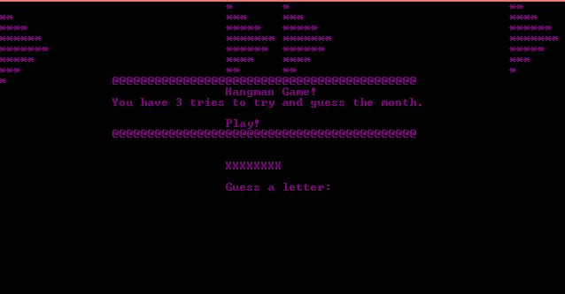
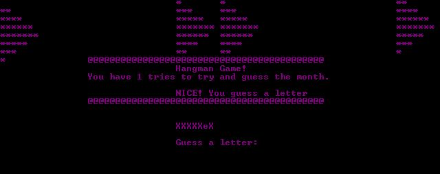
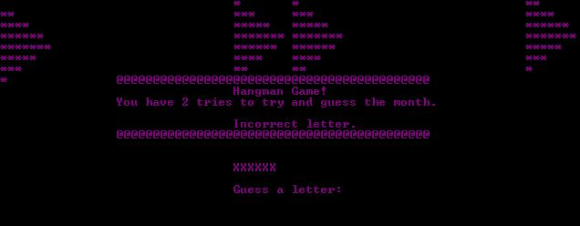
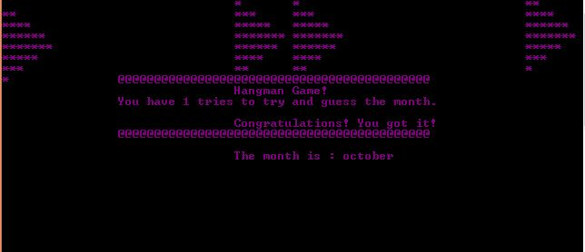
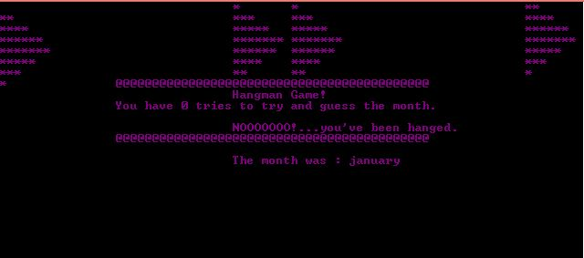

# Hangman Game
1. In this project the user will be ask to guess the month of the year, the user will answer this by entering a letter they think is in the word. 
2. The program will display a message when the user correctly or incorrectly guesses a letter and display all previously guessed letters so the user doesn't guess them again. 
3. The user have three (3) tries to incorrectly guess the word, whenever the user run out of tries the game will end otherwise if they get it correct they will be congratulated.

## Game starts

## User made a correct guess

## User made a wrong guess

## User guessed all the letters correctly and won the game

## User loses the game as he guessed the letters incorrectly and ran out of tries 

